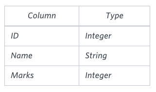

## Revising the Select Query 1.
Solved on 2024.07.09  
[SQl - Revising the Select Query 1.](https://www.hackerrank.com/challenges/revising-the-select-query/problem?isFullScreen=true)
> Q. Query all columns for all American cities in the CITY table with populations larger than 100000. The CountryCode for America is USA.
The CITY table is described as follows:
    <p align="center">
    
    </p>

A.
```sql
select *
from city
where countrycode='USA'
           and population>100000;
```
<br>

## Revision the Seelct Query 2.
Solved on 2024.07.09  
[SQl - Revising the Select Query 2.](https://www.hackerrank.com/challenges/revising-the-select-query-2/problem?isFullScreen=true)
> Q. Query the NAME field for all American cities in the CITY table with populations larger than 120000. The CountryCode for America is USA.
The CITY table is described as follows:
    <p align="center">
    
    </p>

A.
```sql
select name
from city
where countrycode='USA'
           and population>120000;
```
<br>

## Select All.
Solved on 2024.07.09  
[SQl - Select All.](https://www.hackerrank.com/challenges/select-all-sql/problem?isFullScreen=true)
> Q. Query all columns (attributes) for every row in the CITY table.
The CITY table is described as follows:
    <p align="center">
    
    </p>

A.
```sql
select *
from city;
```
<br>

## Select By ID.
Solved on 2024.07.09  
[SQl - Select By ID.](https://www.hackerrank.com/challenges/select-by-id/problem?isFullScreen=true)
> Q. Query all columns for a city in CITY with the ID 1661.
The CITY table is described as follows:
    <p align="center">
    
    </p>

A.
```sql
select *
from city
where id=1661;
```
<br>

## Japanese Cities' Attrbutes.
Solved on 2024.07.09  
[SQl - Japanese Cities' Attrbutes.](https://www.hackerrank.com/challenges/japanese-cities-attributes/problem?isFullScreen=true)
> Q. Query all attributes of every Japanese city in the CITY table. The COUNTRYCODE for Japan is JPN.
The CITY table is described as follows:
    <p align="center">
    
    </p>

A.
```sql
select *
from city
where countrycode='JPN';
```
<br>

## Japanese Cities' Names.
Solved on 2024.07.09  
[SQl - Japanese Cities' Names.](https://www.hackerrank.com/challenges/japanese-cities-name/problem?isFullScreen=true)
> Q. Query the names of all the Japanese cities in the CITY table. The COUNTRYCODE for Japan is JPN.
The CITY table is described as follows:
    <p align="center">
    
    </p>

A.
```sql
select name 
from city
where countrycode='JPN';
```
<br>

## Weather Observation Station 1.
Solved on 2024.07.09  
[SQl - Weather Observation Station 1.](https://www.hackerrank.com/challenges/weather-observation-station-1/problem?isFullScreen=true)
> Q. Query a list of CITY and STATE from the STATION table.
The STATION table is described as follows:
    <p align="center">
    
    </p>

A.
```sql
select city, state
from station;
```
<br>

## Weather Observation Station 3.
Solved on 2024.07.09  
[SQl - Weather Observation Station 3.](https://www.hackerrank.com/challenges/weather-observation-station-3/problem?isFullScreen=true)
> Q. Query a list of CITY names from STATION for cities that have an even ID number. Print the results in any order, but exclude duplicates from the answer.
The STATION table is described as follows:
    <p align="center">
    
    </p>

A.
```sql
select distinct city
from station
where id%2=0;
```
<br>

## Weather Observation Station 4.
Solved on 2024.07.09  
[SQl - Weather Observation Station 4.](https://www.hackerrank.com/challenges/weather-observation-station-4/problem?isFullScreen=true)
> Q. Find the difference between the total number of CITY entries in the table and the number of distinct CITY entries in the table.
The STATION table is described as follows:
    <p align="center">
    
    </p>
For example, if there are three records in the table with CITY values 'New York', 'New York', 'Bengalaru', there are 2 different city names: 'New York' and 'Bengalaru'. The query returns 1, because *total number of records - number of uique city names = 3 - 2 = 1*.

A. 
```sql
select
    (select count(city)
    from station)
    -
    (select count(distinct city)
    from station);
```
<br>

## Weather Observation Station 5.
Solved on 2024.07.09  
[SQl - Weather Observation Station 5.](https://www.hackerrank.com/challenges/weather-observation-station-5/problem?isFullScreen=true)
> Q. Query the two cities in STATION with the shortest and longest CITY names, as well as their respective lengths (i.e.: number of characters in the name). If there is more than one smallest or largest city, choose the one that comes first when ordered alphabetically.
The STATION table is described as follows:
    <p align="center">
    
    </p>
For example, CITY has four entries: DEF, ABC, PQRS and WXY.  
**Sample Output**  
    - ABC 3   
    - PQRS 4  
**Explanation**  
When ordered alphabetically, the CITY names are listed as ABC, DEF, PQRS, and WXY, with lengths  and . The longest name is PQRS, but there are  options for shortest named city. Choose ABC, because it comes first alphabetically.  
**Note**  
You can write two separate queries to get the desired output. It need not be a single query.

A.
```sql
(select city, length(city)
from station
order by length(city) desc, city asc
limit 1)

union

(select city, length(city)
from station
order by length(city), city
limit 1);
```
<br>

## Weather Observation Station 6.
Solved on 2024.07.09  
[SQl - Weather Observation Station 6.](https://www.hackerrank.com/challenges/weather-observation-station-6/problem?isFullScreen=true)
> Q. Query the list of CITY names starting with vowels (i.e., a, e, i, o, or u) from STATION. Your result cannot contain duplicates.
The STATION table is described as follows:
    <p align="center">
    
    </p>

A.
```sql
select city
from station
where city like 'a%'
           or city like 'e%'
           or city like 'i%'
           or city like 'o%'
           or city like 'u%'; 
```
<br>

## Weather Observation Station 7.
Solved on 2024.07.09  
[SQl - Weather Observation Station 7.](https://www.hackerrank.com/challenges/weather-observation-station-7/problem?isFullScreen=true)
> Q. Query the list of CITY names ending with vowels (a, e, i, o, u) from STATION. Your result cannot contain duplicates.
The STATION table is described as follows:
    <p align="center">
    
    </p>

A.
```sql
select distinct city
from station
where city like '%a'
           or city like '%e'
           or city like '%i'
           or city like '%o'
           or city like '%u';
```
<br>

## Weather Observation Station 8.
Solved on 2024.07.10  
[SQl - Weather Observation Station 8.](https://www.hackerrank.com/challenges/weather-observation-station-8/problem?isFullScreen=true)
> Q. Query the list of CITY names from STATION which have vowels (i.e., a, e, i, o, and u) as both their first and last characters. Your result cannot contain duplicates.
The STATION table is described as follows:
    <p align="center">
    
    </p>

A.
```sql
select distinct city
from station
where (city like 'a%'
        or city like 'e%'
        or city like 'i%'
        or city like 'o%'
        or city like 'u%')
    and
      (city like '%a'
        or city like '%e'
        or city like '%i'
        or city like '%o'
        or city like '%u');
```
<br>

## Weather Observation Station 9.
Solved on 2024.07.10  
[SQl - Weather Observation Station 9.](https://www.hackerrank.com/challenges/weather-observation-station-9/problem?isFullScreen=true)
> Q. Query the list of CITY names from STATION that do not start with vowels. Your result cannot contain duplicates.
The STATION table is described as follows:
    <p align="center">
    
    </p>

A.
```sql
select distinct city
from station
where not (city like 'a%'
        or city like 'e%'
        or city like 'i%'
        or city like 'o%'
        or city like 'u%');
```
<br>


## Weather Observation Station 10.
Solved on 2024.07.10  
[SQl - Weather Observation Station 10.](https://www.hackerrank.com/challenges/weather-observation-station-10/problem?isFullScreen=true)
> Q. Query the list of CITY names from STATION that do not end with vowels. Your result cannot contain duplicates.
The STATION table is described as follows:
    <p align="center">
    
    </p>

A.
```sql
select distinct city
from station
where not (city like '%a'
        or city like '%e'
        or city like '%i'
        or city like '%o'
        or city like '%u');
```
<br>

## Weather Observation Station 11.
Solved on 2024.07.10  
[SQl - Weather Observation Station 11.](https://www.hackerrank.com/challenges/weather-observation-station-11/problem?isFullScreen=true)
> Q. Query the list of CITY names from STATION that either do not start with vowels or do not end with vowels. Your result cannot contain duplicates.
The STATION table is described as follows:
    <p align="center">
    
    </p>

A.
```sql
select distinct city
from station
where 
        (not (city like 'a%'
                or city like 'e%'
                or city like 'i%'
                or city like 'o%'
                or city like 'u%'))
        or
        (not (city like '%a'
                or city like '%e'
                or city like '%i'
                or city like '%o'
                or city like '%u'));
```
<br>

## Weather Observation Station 12.
Solved on 2024.07.10  
[SQl - Weather Observation Station 12.](https://www.hackerrank.com/challenges/weather-observation-station-12/problem?isFullScreen=true)
> Q. Query the list of CITY names from STATION that do not start with vowels and do not end with vowels. Your result cannot contain duplicates.
The STATION table is described as follows:
    <p align="center">
    
    </p>

A.
```sql
select distinct city
from station
where 
        (not (city like 'a%'
                or city like 'e%'
                or city like 'i%'
                or city like 'o%'
                or city like 'u%'))
        and
        (not (city like '%a'
                or city like '%e'
                or city like '%i'
                or city like '%o'
                or city like '%u'));
```
<br>

## Higher Than 75 Marks.
Solved on 2024.07.10  
[SQl - Higher Than 75 Marks.](https://www.hackerrank.com/challenges/more-than-75-marks/problem?isFullScreen=true)
> Q. Query the Name of any student in STUDENTS who scored higher than  Marks. Order your output by the last three characters of each name. If two or more students both have names ending in the same last three characters (i.e.: Bobby, Robby, etc.), secondary sort them by ascending ID.
The STUDENTS table is described as follows:
    <p align="center">
    
    </p>
The Name column only contains uppercase (A-Z) and lowercase (a-z) letters.

A.
```sql
select name
from students
where marks > 75
order by mid(name, -3) asc, id asc;
```
<br>

## Employee Salaries.
Solved on 2024.07.10  
[SQl - Employee Salaries.](https://www.hackerrank.com/challenges/salary-of-employees/problem?isFullScreen=true)
> Q. Write a query that prints a list of employee names (i.e.: the name attribute) for employees in Employee having a salary greater than  per month who have been employees for less than  months. Sort your result by ascending employee_id.
The Employee table containing employee data for a company is described as follows:
    <p align="center">
    
    </p>
where employee_id is an employee's ID number, name is their name, months is the total number of months they've been working for the company, and salary is the their monthly salary.

A.
```sql
select name
from employee
where salary>2000
    and months<10
order by employee_id asc;
```
<br>

## Employee Names.
Solved on 2024.07.10  
[SQl - Employee Names.](https://www.hackerrank.com/challenges/name-of-employees/problem?isFullScreen=true)
> Q. Write a query that prints a list of employee names (i.e.: the name attribute) from the Employee table in alphabetical order.
The Employee table containing employee data for a company is described as follows:
    <p align="center">
    
    </p>
where employee_id is an employee's ID number, name is their name, months is the total number of months they've been working for the company, and salary is the their monthly salary.

A.
```sql
select name 
from employee
order by name asc;
```
<br>