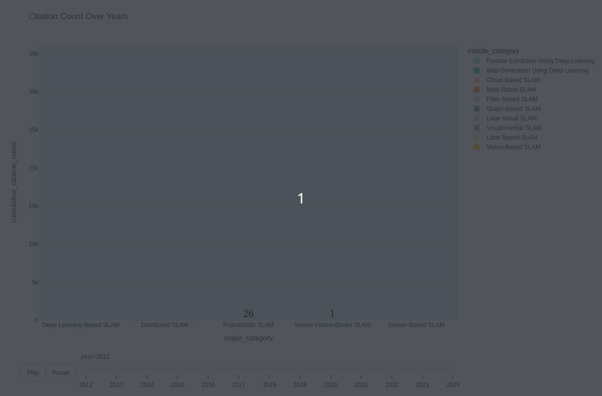

## Robot Tech Keyword Trend Analysis with paper.
Created on 2024.07.19  

### :pushpin: SLAM 관련 논문 메타데이터 크롤링
[arXiv Link](https://arxiv.org/search/cs?query=slam&searchtype=all&abstracts=show&order=-announced_date_first&size=50)

**Background**

```
SLAM 관련 논문 pdf를 크롤링한 이후, 추가적으로 위의 작업을 진행함.
```

**Reason**
```
1. 5일이라는 짧은 프로젝트 기간

2. pdf에서 제출일자나 저자 등과 같은 정보를 추출하는 것이 쉽지 않음. 가령, 잘 처리해서 가져올 수 있다고 해도 많은 예외처리가 불가피하다고 생각.

따라서, 사이트에서 수집할 수 있는 정보를 최대한 많이 정확하게 수집해서 pdf 데이터와 합치는 것이 최선이라고 판단함.
```

**Process**
```
step 1. Chrome Driver로 slam 관련 논문을 검색한 결과가 출력되어 있는 arxiv 사이트 접속.

step 2. 해당 페이지에서 abstract 전문이 다 보이도록 more 버튼을 모두 클릭하도록 함. 

step 3. 현재 페이지의 html 소스를 리스트에 저장하고 next 버튼 눌러서 다음 페이지로 이동.

step 4. 앞서 했던 작업을 페이지마다 수행하고, 각 페이지의 html 소스가 저장되어있는 리스트를 생성.

step 5. 드라이버를 종료.

step 6. BeautifulSoup으로 원하는 정보를 추출.

step 7. 추출한 데이터를 db에 저장.

step 8. db에 잘 저장이 되었는지 확인한 후에 크롤링 작업을 마무리.
```

**웹 크롤링 자동화 코드**
```python
def get_research_paper_result_html(url):
    
    # 웹페이지 접속
    driver = webdriver.Chrome(service=Service("../EDA/driver/chromedriver"))
    driver.get(url)
    driver.maximize_window()
    driver.implicitly_wait(3)
    if driver is not None:
        print("웹페이지 접속 완료", "\n")
    
    # 한 페이지 당 200개씩 검색    
    num_per_page = driver.find_element(By.ID, "size")
    num_per_page.send_keys(200)

    go_btn = driver.find_element(By.CLASS_NAME, "button.is-small.is-link")
    go_btn.click()
    time.sleep(1)
    
    # page 수 계산    
    total_search = driver.find_element(By.CLASS_NAME, "title.is-clearfix")
    total = int(total_search.text.split(" ")[3].replace(",", ""))
    num_pages = int(total/200)
    
    # 페이지 별 html 리스트 생성
    html_list = []
    for _ in range(num_pages+1):
        time.sleep(0.5)
        result_list = driver.find_elements(By.CLASS_NAME, "arxiv-result")

        for result in result_list:
            abstract = result.find_element(By.CLASS_NAME, "abstract-short.has-text-grey-dark.mathjax")
            try:
                more_click = abstract.find_element(By.CLASS_NAME, "is-size-7")
                more_click.click()
            except:
                pass
            
        html = driver.page_source
        html_list.append(html)
        
        try:
            next_btn = driver.find_element(By.CLASS_NAME, "pagination-next")
            wait = WebDriverWait(driver, 5)
            next_btn = wait.until(EC.element_to_be_clickable((By.CLASS_NAME, "pagination-next")))
            next_btn.click()
        except:
            break
    
    # driver 종료
    driver.close()

    return html_list


def extract_research_info(i, id_list, title_list, author_list, abstract_list, date_list):

    # id
    pattern = r"\d+.\d+"
    id = re.findall(pattern, id_list[i].get_text().split("\n")[0])[0]
    # title
    title = title_list[i].get_text().split("\n")[2].replace("        ", "")
    if len(title) < 10:
        title = title_list[i].get_text().split("\n")[1].replace("        ", "")
    # author    
    authors = ", ".join([author.text for author in author_list[i].find_all("a")])
    # abstrac
    abstract = abstract_list[i].get_text().split("\n")[-4].replace("        ", "")
    # date
    month_dict = {"January" : "01",
                "February" : "02",
                "March" : "03",
                "April" : "04",
                "May" : "05",
                "June" : "06",
                "July" : "07",
                "August" : "08",
                "September" : "09",
                "October" : "10",
                "November" : "11",
                "December" : "12",}
    
    pattern = r"\w+\s(\d+)\s(\w+),\s(\d+)"
    re_result = re.findall(pattern, date_list[0].get_text().split(";")[0])
    date = re_result[0][2] + "-" + month_dict[re_result[0][1]] + "-" + re_result[0][0].zfill(2)

    return [id, title, authors, abstract, date]
```
```python
local = mysql.connector.connect(
    host = "database-1.c3aacucygorj.ap-northeast-2.rds.amazonaws.com",
    port = 3306,
    user = "root",
    password = "20162453",
    database = "eda_team_6"
)
cur = local.cursor(buffered=True)

sql = \
    """
    drop table 
    if exists data
    """
cur.execute(sql)

sql = \
    """
    create table data
    (
        id varchar(32),
        title LONGTEXT,
        author LONGTEXT,
        abstract LONGTEXT,
        date date
    )
    """
cur.execute(sql)


url = "https://arxiv.org/search/cs?query=slam&searchtype=all&abstracts=show&order=-announced_date_first&size=50"
html_list = get_research_paper_result_html(url)

for idx, html in tqdm(enumerate(html_list)):

    soup = BeautifulSoup(html, "html.parser")

    # 정보별 리스트 생성
    id_list = soup.find_all("p", "list-title is-inline-block")
    title_list = soup.find_all("p", "title is-5 mathjax")
    author_list = soup.find_all("p", "authors")
    abstract_list = soup.find_all("p", "abstract mathjax")
    result_list = soup.find_all("li", "arxiv-result")
    
    for i in range(len(title_list)):
        date_list = result_list[i].find_all("p", class_="is-size-7")
        data_row = extract_research_info(i, id_list, title_list, author_list, abstract_list, date_list)

        sql = \
        """
        insert into data
        values (%s, %s, %s, %s, %s)
        """
        cur.execute(sql, tuple(data_row))
        print(tuple(data_row))

        local.commit()

local.close()
```

**DB 저장 확인**
```python
local = mysql.connector.connect(
    host = "database-1.c3aacucygorj.ap-northeast-2.rds.amazonaws.com",
    port = 3306,
    user = "mj",
    password = "1",
    database = "eda_team_6"
)
cur = local.cursor(buffered=True)

sql = \
    """
    select *
    from slam_crawling_data
    """

data_df = pd.read_sql(sql, local)
local.close()

data_df.head()
```


<br>

### :pushpin: SLAM 카테고리 분류 시각화
**A. 현재까지 제출된 slam 관련 논문의 개수와 인용횟수를 카테고리 별로 파악.** 

- 대분류, 중분류, 소분류 순으로 그룹화.
- 그룹별 논문 수는 count, 인용횟수는 sum.
- 박스의 크기는 인용횟수의 합, 색상은 논문의 개수로 설정.
- plotly의 treemap으로 시각화.

<p align="center">

</p>
<p align="center">
Figure 1. SLAM 카테고리 계층별 논문 개수 및 인용횟수 시각화
</p>

> **분석 내용**
<br>

>> 1. Figure 1의 그래프에서 대체로 박스 크기가 크고, 색상도 밝은 딥러닝 및 센서 기반 slam 기술이 관련 논문 수와 인용횟수 합 측면에서 지배적인 것으로 보임. 이는 해당 기술들에 대한 연구가 많이 진행되었기 때문이라고 생각.
<br>

>> 2. 특히, 센서 기반 slam의 하위 카테고리인 비전 기반 slam 기술의 경우에, 다른 하위 카테고리 기술들과 비교해서 관련 논문의 수와 인용횟수가 모두 높음. 비전 기반 slam에 관한 연구활동이 활발했고, 관심도 또한 매우 높은 것으로 파악.
<br>

>> 3. 분산 slam의 하위 카테고리인 클라우드 기반 slam 기술의 경우, 색상으로 보아 관련 논문의 수는 많지 않지만, 박스 크기로 볼때 인용횟수가 높음. slam의 분산 접근 방식이 연구자들의 주목을 받고 있고, 이 기술에 관한 연구활동이 활발히 진행중이라고 생각.
<br>

>> 4. 반면, 확률론적 slam의 경우에, 관련 논문의 수가 많은 것에 비해서, 인용횟수가 낮음. 연구가 활발히 이루어졌지만 아직 주목받지 못했거나, 반대로 매우 특화된 분야, 아니면 이미 포화된 연구 분야일 가능성이 있다고 봄.
<br>

>> 5. 결론적으로, 카테고리별 총 논문의 개수와 인용횟수의 합으로 보아서, 2024년도까지 딥러닝 및 센서 기반 slam 기술에 관한 연구활동이 활발했고, 분산 slam 기술이 주목받아 왔다고 분석을 완료함.

<br>

**B. 연도별로 논문 인용횟수 누적합의 변화 양상을  카테고리 별로 확인.**

- 연도, 대분류, 중분류 순으로  그룹화.
- 그룹별 논문 count, 인용횟수 sum.
- 연도가 지남에 따라 카테고리별로 인용횟수의 합을 누적.
- plotly의 bar 그래프 애니메이션으로 시각화.

<p align="center">

</p>
<p align="center">
Figure 2. SLAM 카테고리별 논문 인용횟수 누적합 변화 양상
</p>

> **분석 내용**
<br>

>> 1. 확률론적 slam은 2012년부터 현재까지 꾸준히 연구가 진행됨. 하지만, 논문 인용횟수가 높지는 않아 연구자들의 많은 주목을 받지 않았고, '각 시점에서의 주요 연구 분야이다' 라고는 볼 수 없다고 봄. 다만, 지속적으로 참조되고 있음으로 보아 중요도가 그래도 높은 분야라고 생각.
<br>

>> 2. 2014년 이후로, 분산 slam 및 딥러닝 기반 slam  관련 논문의 인용수가 급격하게 증가함. 이는 MIT에서 2014년 올해의 10대 혁신 기술 중 하나로 딥러닝 기술을 선정하였고, 이때 미국 실리콘 밸리를 중심으로 딥러닝 기술이 집중적으로 조명되었다는 점에서 최신 기술 동향에 대한 연구자들의 관심이 반영된 것으로 파악.
<br>

>> 3. 2015년 이후로 비전 기반 slam 관련 논문 인용횟수가 급격하게 증가함에 따라 비전 기반 slam 기술의 연구 관심도와 중요도가 높아졌다고 판단.
<br>

>> 4. 분산 slam 기술의 경우, 2013년부터 지금까지 연구가 진행됨과 동시에 논문 인용횟수가 높은 것으로 보아서 관련 기술에 대한 연구활동이 활발히 진행되고 있으며, 연구 중요도 또한 매우 높다고 생각.
<br>

>> 5. 2019년 이후로는 딥러닝 및 센서 기반 slam 기술과 관련된 논문의 인용수가 급격하게 증가. 이 기술들이 최근 slam  기술 연구 트렌드임을 시사하며 중요도 또한 높은 것으로 분석을 완료함.

<br>

**C. 연도 및 카테고리별 논문 수의 누적합 변화 양상을 논문 인용횟수와 같이 파악.**

- 제출일자, 대분류 순으로  그룹화.
- 그룹별 논문 count, 인용횟수 sum.
- 연도가 지남에 따라 카테고리별로 인용횟수의 합을 누적.
- x축은 제출일자, y축은 날짜순으로 누적한 논문의 개수, 원의 크기는 논문 인용 횟수로 설정
- plotly의 scatter 그래프으로 시각화.

<p align="center">

</p>
<p align="center">
Figure 3. 연도 흐름에 따른 SLAM 카테고리별 논문 인용횟수 누적합 및 논문 수 경향성
</p>

> **분석 내용**
<br>

>> 1. 위 그래프의 분석과 동일.
<br>

>> 2. 2019년에 딥러닝 및 센서 퓨전 slam 기술돠 관련된 논문의 인용수가 전년도에 비해 증가한 것으로 보아 해당 년도에 해당 기술의 중요도가 높아졌다고 봄. 하지만, 2020년 이후로 논문 수 증가량과 논문 인용횟수가 감소하는데, 이는 코로나의 여파로 연구가 활발히 진행되지 못했다고 분석을 완료함.

----
<br>

```
**분석 내용 최종 정리**  

3개의 시각화 자료를 통해 slam 기술 관련 논문을 분석한 바에 의하면,
2014년 이후 딥러닝 및 센서 기반 SLAM 기술이 연구자들 사이에서 큰 관심을 받으며 연구활동이 활발히 진행되었고, 비전 기반 SLAM 기술이 특히 높은 인용 횟수를 기록했다는 점.
분산 slam 기술의 경우, 지속적으로 활발한 연구활동이 진행됨과 동시에 꾸준한 관심을 받고 있다는 점.
반면, 확률론적 SLAM은 꾸준한 연구에도 불구하고 상대적으로 낮은 인용 횟수를 보이면서 주요 연구 분야로는 부각되지 않았다는 점.
마지막으로, 2019년 이후, 전반적으로 딥러닝과 센서 퓨전 기반 SLAM 기술이 최신 연구 트렌드로 자리 잡았지만, 2020년 이후 코로나 팬데믹의 영향으로 연구 활동이 다소 감소했다는 점으로
slam 기술의 과거와 현재 경향성에 대해서 결론지을 수 있을 것 같습니다.
```